# Ilmora — Entity Relationship Diagram (ERD)

**Version:** 2.0.0-draft
**Date:** April 15, 2026
**Authors:** Architecture Team
**Classification:** Public — Draft

---

## Laravel Conventions Applied

This ERD follows Laravel/Eloquent naming conventions throughout:

- **Table names:** plural, snake_case (`halaqat`, `halaqah_sessions`, `assignments`)
- **Primary keys:** `id` (unsigned big integer, auto-increment)
- **Foreign keys:** `{singular_table}_id` (e.g., `user_id`, `halaqah_id`)
- **Timestamps:** `created_at`, `updated_at` (via `$table->timestamps()`)
- **Soft deletes:** `deleted_at` (via `$table->softDeletes()`)
- **Polymorphic columns:** `{name}_type` + `{name}_id` where applicable
- **Boolean columns:** `is_` prefix (e.g., `is_active`, `is_archived`)
- **Laravel auth fields:** `remember_token`, `email_verified_at`, `password` (bcrypt hash)

> **Note on "Halaqat":** In Arabic, "Halaqat" (حلقات) is the plural of "Halaqah" (حلقة). The table is named `halaqat` (plural, per Laravel convention), while the Eloquent model is `Halaqah` (singular PascalCase).

## Mermaid ERD

```mermaid
erDiagram
    %% ==========================================
    %% MULTI-TENANCY
    %% ==========================================

    tenants {
        bigint id PK
        varchar name
        varchar slug UK
        varchar plan "free|pro|institution"
        json settings "nullable"
        boolean is_active "default true"
        timestamp created_at
        timestamp updated_at
        timestamp deleted_at "nullable"
    }

    %% ==========================================
    %% USERS & ROLES
    %% ==========================================

    users {
        bigint id PK
        bigint tenant_id FK
        varchar name
        varchar email UK
        timestamp email_verified_at "nullable"
        varchar password
        varchar avatar_url "nullable"
        varchar phone "nullable"
        varchar locale "default ar"
        varchar timezone "default Asia/Riyadh"
        varchar auth_provider "email|google"
        varchar external_auth_id "nullable"
        boolean is_active "default true"
        timestamp last_login_at "nullable"
        varchar remember_token "nullable"
        timestamp created_at
        timestamp updated_at
        timestamp deleted_at "nullable"
    }

    roles {
        bigint id PK
        varchar name UK "teacher|student|admin|parent"
        varchar guard_name "default web"
        varchar description "nullable"
        timestamp created_at
        timestamp updated_at
    }

    role_user {
        bigint id PK
        bigint user_id FK
        bigint role_id FK
        bigint tenant_id FK
        timestamp created_at
        timestamp updated_at
    }

    permissions {
        bigint id PK
        varchar name UK "e.g. halaqat.create"
        varchar guard_name "default web"
        varchar description "nullable"
        timestamp created_at
        timestamp updated_at
    }

    permission_role {
        bigint id PK
        bigint role_id FK
        bigint permission_id FK
    }

    %% ==========================================
    %% SCHOOLS & HALAQAT
    %% ==========================================

    schools {
        bigint id PK
        bigint tenant_id FK
        varchar name
        text description "nullable"
        varchar address "nullable"
        varchar city "nullable"
        varchar country "nullable"
        varchar logo_url "nullable"
        json settings "nullable"
        boolean is_active "default true"
        timestamp created_at
        timestamp updated_at
        timestamp deleted_at "nullable"
    }

    halaqat {
        bigint id PK
        bigint tenant_id FK
        bigint teacher_id FK "users.id"
        bigint school_id FK "nullable"
        varchar name
        text description "nullable"
        varchar type "hifz|murajaah|tilawah|tafsir|mixed"
        varchar color_hex "default #3B82F6"
        integer max_students "nullable"
        json recurring_schedule "nullable"
        boolean is_active "default true"
        boolean is_archived "default false"
        timestamp created_at
        timestamp updated_at
        timestamp deleted_at "nullable"
    }

    halaqah_student {
        bigint id PK
        bigint halaqah_id FK
        bigint student_id FK "users.id"
        varchar status "active|paused|withdrawn"
        integer sort_order "default 0"
        timestamp enrolled_at
        timestamp withdrawn_at "nullable"
        timestamp created_at
        timestamp updated_at
    }

    %% ==========================================
    %% SESSIONS & SCHEDULE
    %% ==========================================

    halaqah_sessions {
        bigint id PK
        bigint halaqah_id FK
        bigint teacher_id FK "users.id"
        bigint tenant_id FK
        date session_date
        time start_time
        time end_time
        varchar timezone "default Asia/Riyadh"
        varchar status "scheduled|in_progress|completed|cancelled"
        text teacher_notes "nullable"
        boolean is_recurring_instance "default false"
        bigint recurring_rule_id FK "nullable"
        timestamp created_at
        timestamp updated_at
        timestamp deleted_at "nullable"
    }

    recurring_rules {
        bigint id PK
        bigint halaqah_id FK
        varchar frequency "weekly"
        tinyint day_of_week "0=Sun 6=Sat"
        time start_time
        time end_time
        varchar timezone "default Asia/Riyadh"
        date effective_from
        date effective_until "nullable"
        timestamp created_at
        timestamp updated_at
    }

    attendances {
        bigint id PK
        bigint session_id FK
        bigint student_id FK "users.id"
        varchar status "present|absent|excused|late"
        text note "nullable"
        timestamp marked_at
        timestamp created_at
        timestamp updated_at
    }

    %% ==========================================
    %% ASSIGNMENTS & PROGRESS
    %% ==========================================

    assignments {
        bigint id PK
        bigint session_id FK
        bigint student_id FK "users.id"
        bigint teacher_id FK "users.id"
        bigint tenant_id FK
        varchar type "hifz|murajaah|tilawah"
        integer surah_number
        varchar surah_name_ar
        varchar surah_name_en
        integer start_ayah
        integer end_ayah
        integer juz_number "nullable"
        integer start_page "nullable"
        integer end_page "nullable"
        varchar status "assigned|in_progress|completed|needs_repeat"
        tinyint grade "nullable, 1-5"
        varchar grade_label "nullable"
        text teacher_notes "nullable, private"
        text student_visible_notes "nullable"
        date due_date "nullable"
        timestamp completed_at "nullable"
        timestamp created_at
        timestamp updated_at
        timestamp deleted_at "nullable"
    }

    progress_snapshots {
        bigint id PK
        bigint student_id FK "users.id"
        bigint tenant_id FK
        date snapshot_date
        integer total_ayahs_memorized "default 0"
        integer total_juz_memorized "default 0"
        integer total_pages_memorized "default 0"
        decimal revision_coverage_percent "default 0"
        integer sessions_attended_total "default 0"
        integer sessions_absent_total "default 0"
        decimal average_grade "nullable"
        json memorized_ranges "nullable"
        timestamp created_at
    }

    %% ==========================================
    %% QURAN REFERENCE DATA (seeder-populated)
    %% ==========================================

    surahs {
        integer id PK "1-114"
        varchar name_ar
        varchar name_en
        varchar name_transliteration
        integer total_ayahs
        integer juz_start
        integer page_start
        varchar revelation_type "meccan|medinan"
    }

    %% ==========================================
    %% NOTIFICATIONS
    %% ==========================================

    notifications {
        char id PK "uuid, Laravel convention"
        varchar type "notification class FQCN"
        varchar notifiable_type "App\\Models\\User"
        bigint notifiable_id
        text data "json payload"
        timestamp read_at "nullable"
        timestamp created_at
    }

    notification_preferences {
        bigint id PK
        bigint user_id FK
        varchar notification_type
        boolean in_app_enabled "default true"
        boolean email_enabled "default true"
        boolean push_enabled "default false"
        integer reminder_minutes_before "default 60"
        timestamp created_at
        timestamp updated_at
    }

    %% ==========================================
    %% INVITE SYSTEM
    %% ==========================================

    invites {
        bigint id PK
        bigint halaqah_id FK
        bigint invited_by FK "users.id"
        bigint tenant_id FK
        varchar code UK "short join code"
        varchar invite_type "link|code|email"
        varchar target_email "nullable"
        varchar status "pending|accepted|expired|revoked"
        integer max_uses "default 1"
        integer use_count "default 0"
        timestamp expires_at "nullable"
        timestamp created_at
        timestamp updated_at
    }

    %% ==========================================
    %% AUDIT LOG
    %% ==========================================

    audit_logs {
        bigint id PK
        bigint tenant_id FK
        bigint user_id FK "nullable"
        varchar auditable_type "polymorphic model class"
        bigint auditable_id "polymorphic model id"
        varchar action "create|update|delete|login|logout"
        json old_values "nullable"
        json new_values "nullable"
        varchar ip_address "nullable"
        varchar user_agent "nullable"
        timestamp created_at
    }

    %% ==========================================
    %% RELATIONSHIPS
    %% ==========================================

    tenants ||--o{ users : "has"
    tenants ||--o{ schools : "has"
    tenants ||--o{ halaqat : "has"
    tenants ||--o{ halaqah_sessions : "has"
    tenants ||--o{ assignments : "has"
    tenants ||--o{ invites : "has"
    tenants ||--o{ audit_logs : "has"

    users ||--o{ role_user : "has"
    roles ||--o{ role_user : "assigned_to"
    roles ||--o{ permission_role : "has"
    permissions ||--o{ permission_role : "granted_by"

    users ||--o{ halaqat : "teaches"
    schools ||--o{ halaqat : "contains"
    halaqat ||--o{ halaqah_student : "enrolls"
    users ||--o{ halaqah_student : "enrolled_as_student"

    halaqat ||--o{ halaqah_sessions : "scheduled_in"
    users ||--o{ halaqah_sessions : "taught_by"
    halaqat ||--o{ recurring_rules : "follows"
    recurring_rules ||--o{ halaqah_sessions : "generates"

    halaqah_sessions ||--o{ attendances : "tracks"
    users ||--o{ attendances : "attended_by"

    halaqah_sessions ||--o{ assignments : "contains"
    users ||--o{ assignments : "assigned_to_student"
    users ||--o{ assignments : "created_by_teacher"

    users ||--o{ progress_snapshots : "has"

    users ||--o{ notification_preferences : "configures"

    halaqat ||--o{ invites : "for"
    users ||--o{ invites : "created_by"

    users ||--o{ audit_logs : "performed_by"
```



## ERD Design Notes

### 1. Multi-Tenancy
Every major entity carries a `tenant_id` foreign key. Unlike the original design which proposed PostgreSQL Row-Level Security, the Laravel implementation will use Eloquent global scopes to enforce tenant isolation:

```php
// App\Models\Concerns\BelongsToTenant.php
trait BelongsToTenant
{
    protected static function bootBelongsToTenant(): void
    {
        static::addGlobalScope('tenant', function ($query) {
            $query->where('tenant_id', auth()->user()?->tenant_id);
        });

        static::creating(function ($model) {
            $model->tenant_id = auth()->user()?->tenant_id;
        });
    }
}
```

### 2. Soft Deletes
All mutable entities use Laravel's `SoftDeletes` trait (`$table->softDeletes()` in migrations). Records are never physically deleted — they are filtered out by Eloquent automatically.

### 3. Notifications Table
The `notifications` table follows Laravel's built-in notification schema exactly (`php artisan notifications:table`). It uses a UUID primary key and polymorphic `notifiable_type`/`notifiable_id` columns. The custom `notification_preferences` table extends this with user-configurable settings.

### 4. Audit Log (Polymorphic)
The `audit_logs` table uses Laravel's polymorphic pattern (`auditable_type` + `auditable_id`) to reference any model. This replaces the original ERD's `entity_type` + `entity_id` with the Laravel convention, enabling `$model->auditLogs()` morphMany relationships.

### 5. Quran Reference Data
The `surahs` table is a static reference table populated via `database/seeders/SurahSeeder.php`. Assignment validation uses this to ensure Ayah ranges are valid. The integer `id` (1–114) maps directly to Surah numbers in the Mushaf.

### 6. Pivot Tables
Laravel convention for many-to-many pivots: alphabetical singular names joined by underscore.
- `halaqah_student` (enrollment pivot with extra columns: `status`, `sort_order`, `enrolled_at`)
- `role_user` (role assignment pivot with `tenant_id`)
- `permission_role` (RBAC permission mapping)

### 7. Progress Snapshots
Nightly scheduled command (`php artisan snapshots:compute`) computes and stores `progress_snapshots` records. The latest snapshot is used for dashboards; historical snapshots enable trend charts. This avoids expensive aggregation queries on every page load.

---

## Migration Status

The table below reflects the actual state of `database/migrations/` in the repository. Entities that are already built use the current naming convention (`groups` for halaqat, `group_student` for halaqah_student, etc.). The ERD represents the **target schema** for the full product; some tables will be added or renamed in future phases.

| Entity | Migration Status | Notes |
|--------|-----------------|-------|
| `tenants` | ❌ Not yet built | Replaced for now by `schools` table |
| `users` | ✅ Built | `0001_01_01_000000` — missing `locale`, `timezone`, and ERD-specific columns; extended in `2024_01_01_000002` to add `school_id` and `role` |
| `roles` | ❌ Not yet built | `role` column added directly to `users`; full RBAC not yet implemented |
| `role_user` | ❌ Not yet built | |
| `permissions` | ❌ Not yet built | Consider using spatie/laravel-permission |
| `permission_role` | ❌ Not yet built | |
| `schools` | ✅ Built | `2024_01_01_000001` — maps to the tenant/school concept |
| `halaqat` | ⚠️ Partial | `groups` table built in `2024_01_01_000003`; rename and add ERD columns in a future migration |
| `halaqah_student` | ✅ Built | `group_student` pivot built in `2024_01_01_000004` |
| `halaqah_sessions` | ❌ Not yet built | Named `halaqah_sessions` (not `sessions`) to avoid collision with Laravel's built-in `sessions` table |
| `recurring_rules` | ❌ Not yet built | Core — build in Phase 1 |
| `attendances` | ✅ Built | `2024_01_01_000008` |
| `assignments` | ✅ Built | `2024_01_01_000006` |
| `assignment_student` | ✅ Built | `2024_01_01_000007` (pivot) |
| `lessons` | ✅ Built | `2024_01_01_000005` — per-session Quran progress records |
| `progress_snapshots` | ❌ Not yet built | P1 — build post-MVP |
| `surahs` | ❌ Not yet built | Reference data — seed early |
| `notifications` | ❌ Not yet built | Use `php artisan notifications:table` |
| `notification_preferences` | ❌ Not yet built | P1 feature |
| `invites` | ❌ Not yet built | Core — build in Phase 1 |
| `audit_logs` | ❌ Not yet built | Consider spatie/laravel-activitylog |
| `cache` | ✅ Built | `0001_01_01_000001` — Laravel cache driver table |
| `jobs` | ✅ Built | `0001_01_01_000002` — Laravel queue jobs table |

### Recommended Migration Order

```
1. tenants
2. users (modify default migration)
3. roles + permissions + pivots (via spatie/laravel-permission)
4. schools
5. surahs (+ SurahSeeder)
6. halaqat
7. halaqah_student
8. recurring_rules
9. halaqah_sessions
10. assignments
11. attendances
12. invites
13. notifications (artisan command)
14. notification_preferences
15. progress_snapshots
16. audit_logs
```